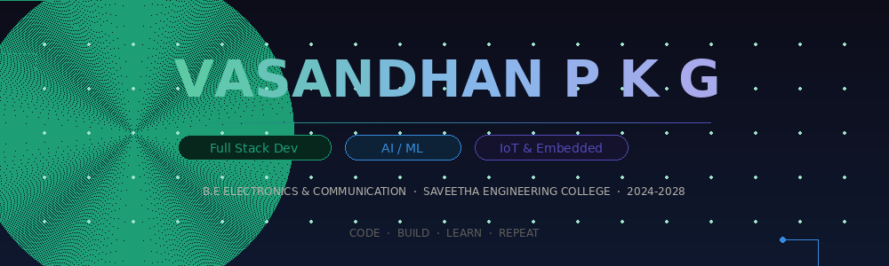

# 👋 Hi, I'm Vasandhan P K G

### Electronics & Communication Engineering Student
### Full Stack Developer • AI Enthusiast • Embedded Systems Learner

---

# 🚀 About Me

🎓 B.E Electronics & Communication Engineering (2024-2028)

🏫 Saveetha Engineering College

💻 Full Stack Developer

🤖 AI / Machine Learning Enthusiast

📡 IoT & Embedded Systems Learner

🏆 Oracle Certified Java Programmer

🔥 Solved 500+ Coding Problems

🌱 Currently Learning:

- Spring Boot
- Embedded Systems
- System Design
- Competitive Programming
- AI & Machine Learning

---

# 🛠 Tech Stack

## Languages

## Frontend

## Backend

## Database & Tools

---

# 🚀 Featured Projects

## 🩺 Edema Detection System

AI-powered medical image analysis platform.

### Tech

Python • FastAPI • OpenCV • Transformers

### Highlights

- 94.2% Accuracy
- Vision Transformer Model
- DICOM Image Processing
- Reduced Processing Time from 15 mins → 30 secs

---

## ⚡ AI Smart Energy Platform

IoT based energy monitoring system.

### Tech

ESP32 • TensorFlow • Firebase

### Highlights

- Real-time Monitoring
- Energy Analytics
- Smart Recommendations
- Reduced Energy Consumption by 15–25%

---

## 🏥 DiagnoSim

Virtual Patient Simulation Platform.

### Tech

React.js • Node.js • MongoDB

### Features

- Medical Simulation
- Real-Time Tracking
- Dynamic Patient Scenarios

---

## 🎓 Campus Engagement Hub

Enterprise Student Management Platform.

### Tech

Spring Boot • MySQL • JWT

### Features

- Secure Authentication
- 5000+ User Support
- Optimized Database Queries

---

# 🏆 Achievements

🥇 Oracle Certified Java Programmer

🏅 Top 25 Finalist – DevHouse Hackathon

📡 IEEE Student Member

🎯 Technical Organizer – Drestein '25

💻 500+ Problems Solved

📚 NPTEL & Coursera Certified

---

# 🏆 LeetCode

---

# 🔥 GitHub Streak

---

# 📊 GitHub Profile Summary

---

# 📈 Most Used Languages

---

# ⏰ Coding Activity

# 📊 Contribution Graph

---

# 👀 Profile Views

---

# 🎯 2026 Goals

✅ Reach 1000+ LeetCode Problems

✅ Master Spring Boot

✅ Learn Embedded Linux

✅ Build Real-world AI Products

✅ Contribute to Open Source

✅ Secure Product-Based Internship

---

## ⭐ Code • Build • Learn • Repeat

